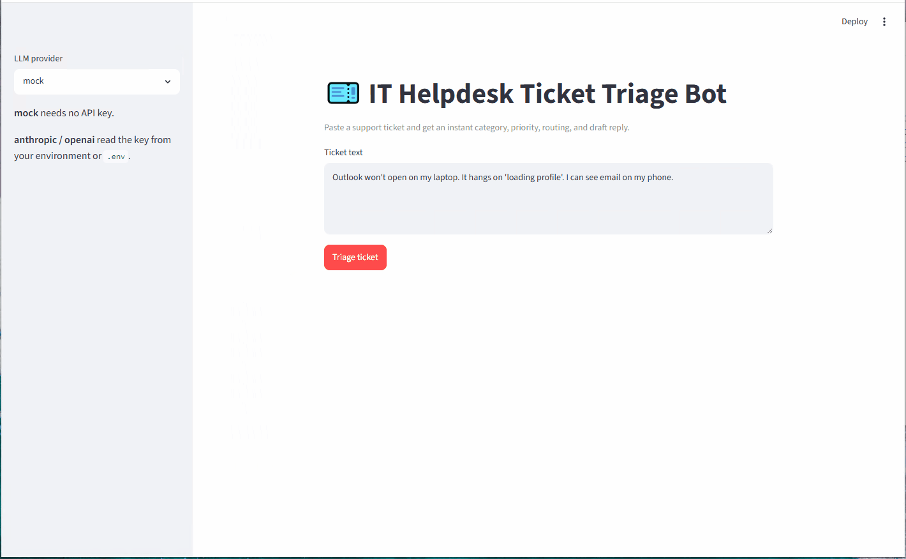

# 🎫 IT Helpdesk Ticket Triage Bot

> Turns a raw IT support ticket into a structured triage — **category, priority (P1–P4), suggested team, summary, and a draft first response** — using an LLM, with a zero-setup fallback so it runs offline.

Built by someone who spent 12+ years on enterprise IT support: this automates the first five minutes of every ticket so analysts spend their time resolving issues, not sorting them.

<!-- TODO: record a 20–30s screen capture, convert to GIF (LICEcap / ShareX), save as docs/demo.gif, and uncomment: -->
<!--  -->

---

## The problem

A service desk receives hundreds of tickets a day as free-form email or text. Before anyone can help, each one has to be read, categorized, prioritized, and routed to the right team — repetitive work that delays the actual fix. This tool does that triage step automatically and consistently.

## What it does

For any ticket, it returns structured JSON:

| Field | Example |
|-------|---------|
| `category` | `Email/M365` |
| `priority` | `P2` |
| `suggested_team` | `M365/Collaboration` |
| `summary` | One-line summary of the issue |
| `draft_response` | A professional first reply to the user |
| `confidence` | `0.82` |

See [`sample_output.md`](sample_output.md) for real output across all 12 sample tickets.

## How it works

```
ticket text ──> prompt builder ──> LLM (Claude / OpenAI) ──> JSON parser ──> triage result
                                        │
                                        └── no API key? ──> deterministic mock classifier
```

Three modes, selected by the `LLM_PROVIDER` environment variable:

- **`mock`** (default) — keyword-based classifier, **needs no API key or dependencies**. Great for demos and offline testing.
- **`anthropic`** — Claude API (`ANTHROPIC_API_KEY`).
- **`openai`** — OpenAI API (`OPENAI_API_KEY`).

If a live call fails (bad key, no network), it logs a warning and **falls back to mock mode** instead of crashing.

## Quick start

```bash
# 1. Clone
git clone https://github.com/rperezga/helpdesk-triage-bot.git
cd helpdesk-triage-bot

# 2. Run a single ticket (mock mode — no setup needed)
python triage.py "Outlook won't open and I can't get my email"

# 3. Batch-process the sample tickets into a CSV report
python triage.py --batch sample_tickets.json --out report.csv
```

### Using a live LLM (optional)

```bash
pip install -r requirements.txt
cp .env.example .env        # then set LLM_PROVIDER and your API key
python triage.py --text "VPN keeps dropping at home" --provider anthropic --pretty
```

### Web UI (optional)

```bash
pip install streamlit
streamlit run app.py
```

## Tech stack

`Python` · `Anthropic / OpenAI APIs` · `argparse CLI` · `Streamlit` (optional UI) · standard-library `csv`/`json`

## Project structure

```
triage.py           # core logic + CLI (single ticket & batch)
app.py              # optional Streamlit UI
sample_tickets.json # 12 realistic sample tickets
sample_output.md    # example results (mock mode)
requirements.txt    # optional dependencies
.env.example        # configuration template
```

## What I learned / design notes

- **Reliability first:** structured JSON with a parsing fallback, and graceful degradation to mock mode so the tool never hard-fails in front of a user.
- **Domain-driven taxonomy:** categories, priorities, and team routing mirror how a real service desk actually triages.
- **Provider-agnostic:** swapping Claude ↔ OpenAI is one environment variable — the same pattern used when integrating LLMs into enterprise tools.

## Roadmap / stretch ideas

- Pull tickets straight from an Outlook inbox or a Freshdesk/Jira queue (free tiers).
- A Power Automate version of the same flow (no-code), documented side-by-side.
- Confidence-based routing: auto-resolve high-confidence FAQs, escalate the rest.

---

**Author:** Roger Perez — IT Operations → AI/Automation · Miami, FL
MIT licensed.
